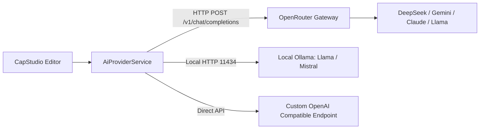

# Creator-Facing Video AI Features Specification

## 1. Overview & Provider Architecture

CapStudio integrates with modern LLM inference endpoints using a **Unified Provider Interface**. The primary recommended gateway is **OpenRouter**, as it provides access to both top-tier frontier models (Claude 3.5 Sonnet, GPT-4o) and generous free-tier models (Gemini 2.0 Flash Exp Free, Llama 3.3 70B Free, Qwen 2.5 72B Free) through a single OpenAI-compatible REST API.



### Provider Configuration Model
In [`SettingsService`](file:///a:/Projects/CapStudio/lib/core/settings/settings_service.dart), the user configures:
- `aiProvider`: `'openrouter'` | `'ollama'` | `'custom'`
- `aiApiKey`: Securely stored string.
- `aiBaseUrl`: Defaults to `https://openrouter.ai/api/v1`.
- `aiModel`: Defaults to `google/gemini-2.0-flash-exp:free` or `deepseek/deepseek-chat`.
- `aiTemperature`: `0.2` (low temperature for deterministic JSON output).

---

## 2. Feature 1: Semantic Viral Moment & Hook Detection

### Problem It Solves
Current rule-based algorithms in [`viral_hook_detector.dart`](file:///a:/Projects/CapStudio/lib/core/video/viral_hook_detector.dart) rely on static regex matching (e.g. searching for phrases like *"did you know"* or *"here's why"*). This misses subtle storytelling hooks, jokes, counter-intuitive statements, and emotional peaks.

### Prompt Specification & Schema
The LLM is provided the timestamped transcription words from [`Project.words`](file:///a:/Projects/CapStudio/lib/core/database/schemas/project.dart) and requested to produce structured JSON:

```json
{
  "system": "You are a professional viral short-form video editor specializing in TikTok, Instagram Reels, and YouTube Shorts. Your job is to analyze video transcripts and identify high-retention segments (20 to 60 seconds long) that feature compelling hooks, high informational or emotional density, and strong conclusions.",
  "user": "Analyze the following transcript words with timestamps [start-end: word] and return a JSON list of candidate viral clips:\n\n[TRANSCRIPT_CHUNKS]",
  "response_format": {
    "type": "json_object"
  }
}
```

### Expected Output Schema
```json
{
  "clips": [
    {
      "start": 14.2,
      "end": 48.5,
      "hookCategory": "Curiosity Gap",
      "displayTitle": "The Secret Formula for Instant Growth",
      "viralScore": 94,
      "reasoning": "Starts with an unexpected contradictory statement, builds tension, and resolves with an actionable takeaway within 34 seconds.",
      "suggestedHashtags": ["#contentcreator", "#growthhacks", "#viralreels"]
    }
  ]
}
```

### Timeline Integration
The resulting JSON maps directly to [`ViralClipCandidate`](file:///a:/Projects/CapStudio/lib/core/video/viral_clip_models.dart), populating [`viral_clipping_candidate_cards.dart`](file:///a:/Projects/CapStudio/lib/features/editor/presentation/widgets/panels/viral_clipping_candidate_cards.dart) with 1-click **"Fork 9:16 Short"** actions.

---

## 3. Feature 2: Smart Transcript Polishing & Diarization

### Problem It Solves
Whisper transcription frequently suffers from:
1. Missing capital letters for proper nouns (names, companies, tools).
2. Lack of commas or question marks in fast dialogue.
3. Word hallucinations or misspelled domain terms (e.g., "Docker", "FFmpeg", "Flutter").

### Timestamp Alignment Algorithm
A critical requirement is that **word timestamps must remain strictly synchronized with the spoken audio**. The LLM must NOT alter the word sequence or drop words; it only modifies spelling, capitalization, and punctuation.

```dart
// Algorithm: Word-to-Word Alignment Mapping
void alignPolishedTranscript(List<WordSchema> original, List<String> polishedWords) {
  // Levenshtein-based fuzzy sequence alignment ensures that each polished word
  // retains the exact original start and end timestamps.
}
```

---

## 4. Feature 3: Contextual Emoji & SFX Mapping

### Pipeline
1. **Sentence Emotion Scoring:** The LLM evaluates sentiment per sentence (Surprise, Humor, Danger, Insight, Question).
2. **Pack Selection:** Maps the word to an emoji from CapStudio's installed sticker packs (`googleAnimated`, `openmoji`, etc.).
3. **Sound Effect (SFX) Syncing:** Automatically attaches matching audio triggers (`pop`, `whoosh`, `ding`, `vine_boom`, `camera_shutter`) to the [`WordSchema.soundEffect`](file:///a:/Projects/CapStudio/lib/core/database/schemas/word.dart) property at that exact millisecond.

---

## 5. Feature 4: "Magic Edit" Natural Language Prompt Bar

### User Experience
At the top of the video editor timeline, the creator has a natural language input field:
> *"Remove all pauses longer than 1.2s, highlight every number in neon green, and bounce captions on the hook."*

### Intent Grammar & Execution Mapping
The LLM converts natural language into atomic CapStudio actions:

```json
{
  "actions": [
    {
      "type": "remove_silence",
      "minDuration": 1.2,
      "noiseGateDb": -35.0
    },
    {
      "type": "update_highlight_style",
      "target": "numbers",
      "mainColor": "#39FF14",
      "secondColor": "#FFFFFF"
    },
    {
      "type": "set_animation",
      "rangeStart": 0.0,
      "rangeEnd": 5.0,
      "animation": "bounce"
    }
  ]
}
```

### Execution Dispatcher
The [`EditorController`](file:///a:/Projects/CapStudio/lib/features/editor/presentation/controllers/editor_controller.dart) consumes the action array and invokes the existing state-modifying mixins:
- `remove_silence` -> [`EditorCoreMixin.applySilenceCuts()`](file:///a:/Projects/CapStudio/lib/features/editor/presentation/controllers/editor_core_mixin.dart)
- `update_highlight_style` -> [`EditorWordOpsMixin.updateWordHighlight()`](file:///a:/Projects/CapStudio/lib/features/editor/presentation/controllers/editor_word_ops_mixin.dart)
- `set_animation` -> [`EditorCoreMixin.updateProjectConfig()`](file:///a:/Projects/CapStudio/lib/features/editor/presentation/controllers/editor_core_mixin.dart)

---

## 6. Multi-Language Subtitle Translation

1. Spoken English words are grouped into natural sentence phrases (3 to 6 words).
2. Translated into target languages (Spanish, Hindi, German, Japanese, Portuguese, etc.).
3. Time spans are interpolated proportionally across the translated syllables so subtitle reading speed matches target language phonetics.
