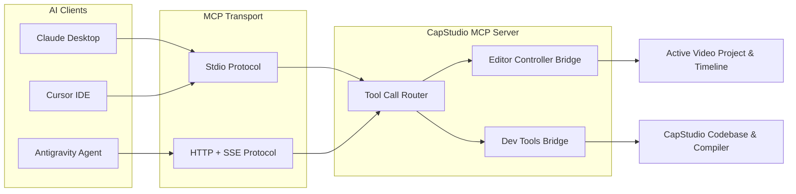

# Model Context Protocol (MCP) Server Specification for CapStudio

## 1. Overview

The **Model Context Protocol (MCP)** is an open standard developed by Anthropic that allows AI applications (such as Claude Desktop, Cursor, Windsurf, or Antigravity) to securely connect to external tools, local applications, and databases.

By implementing an MCP Server for CapStudio, external AI agents gain programmatic access to control video editing workflows, inspect active projects, and perform autonomous code maintenance.



---

## 2. Server Configuration

### Claude Desktop Integration (`claude_desktop_config.json`)
```json
{
  "mcpServers": {
    "capstudio": {
      "command": "dart",
      "args": ["run", "bin/mcp_server.dart"],
      "env": {
        "CAPSTUDIO_WORKSPACE": "A:/Projects/CapStudio"
      }
    }
  }
}
```

---

## 3. Tool Specifications & Schemas

The CapStudio MCP Server exposes two categories of tools:
1. **Editor Operations (Creator Tools)**
2. **Codebase Operations (Developer Tools)**

### Category A: Editor Operations

#### 1. `get_active_project`
* **Description:** Retrieves full metadata, video resolution, duration, and status for the currently active editing project.
* **Input Schema:**
  ```json
  {
    "type": "object",
    "properties": {}
  }
  ```
* **Output:** JSON object representation of the active [`Project`](file:///a:/Projects/CapStudio/lib/core/database/schemas/project.dart).

#### 2. `get_transcript`
* **Description:** Returns the word-by-word timestamped transcript of the video.
* **Input Schema:**
  ```json
  {
    "type": "object",
    "properties": {
      "includeHidden": { "type": "boolean", "default": false }
    }
  }
  ```

#### 3. `apply_timeline_cuts`
* **Description:** Deletes specific time ranges from the video (e.g., removing detected silences or filler words).
* **Input Schema:**
  ```json
  {
    "type": "object",
    "properties": {
      "segments": {
        "type": "array",
        "items": {
          "type": "object",
          "properties": {
            "start": { "type": "number" },
            "end": { "type": "number" }
          },
          "required": ["start", "end"]
        }
      }
    },
    "required": ["segments"]
  }
  ```

#### 4. `set_caption_style`
* **Description:** Applies a design style preset (e.g., 'beast', 'hormozi', 'neon', 'minimal') or custom font/color settings to the subtitles.
* **Input Schema:**
  ```json
  {
    "type": "object",
    "properties": {
      "presetName": { "type": "string", "enum": ["beast", "hormozi", "neon", "minimal", "karaoke"] },
      "fontFamily": { "type": "string" },
      "fontSize": { "type": "number" },
      "mainColor": { "type": "string", "description": "Hex color e.g. #FFA500" }
    }
  }
  ```

#### 5. `trigger_export`
* **Description:** Initiates an FFmpeg video export for the current timeline.
* **Input Schema:**
  ```json
  {
    "type": "object",
    "properties": {
      "mode": { "type": "string", "enum": ["fast", "slow"], "default": "fast" },
      "aspectRatio": { "type": "string", "enum": ["9:16", "16:9", "1:1"], "default": "9:16" },
      "burnSubtitles": { "type": "boolean", "default": true }
    }
  }
  ```

---

### Category B: Codebase Operations (Developer Tools)

#### 1. `search_codebase`
* **Description:** Searches CapStudio's Dart, Kotlin, C++, and build configuration files.
* **Input Schema:**
  ```json
  {
    "type": "object",
    "properties": {
      "query": { "type": "string" },
      "directory": { "type": "string", "default": "lib" }
    },
    "required": ["query"]
  }
  ```

#### 2. `patch_file`
* **Description:** Modifies a source code file using exact character string replacement.
* **Input Schema:**
  ```json
  {
    "type": "object",
    "properties": {
      "path": { "type": "string" },
      "targetContent": { "type": "string" },
      "replacementContent": { "type": "string" }
    },
    "required": ["path", "targetContent", "replacementContent"]
  }
  ```

#### 3. `verify_codebase`
* **Description:** Runs `flutter analyze --no-pub` and `flutter test` to verify zero errors and green tests.
* **Input Schema:**
  ```json
  {
    "type": "object",
    "properties": {
      "runTests": { "type": "boolean", "default": true }
    }
  }
  ```
