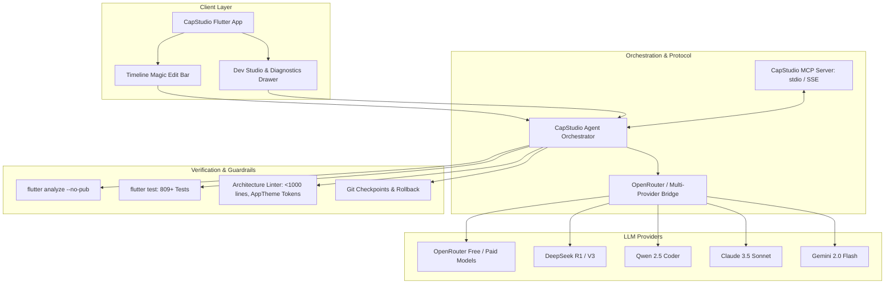

# CapStudio AI Agent & Self-Improving Architecture Blueprint

## 1. Executive Summary

CapStudio is an offline-first, high-performance desktop and web AI caption studio and video editor built with Flutter. This blueprint defines the architectural design for integrating **Large Language Models (LLMs)**, **Autonomous Agentic Coding Loops**, and the **Model Context Protocol (MCP)** into CapStudio.

The AI strategy is built on two distinct but complementary pillars:
1. **Creator-Facing Video AI (End-User Value):** In-app generative and analytical tools powering semantic viral clipping, contextual emoji/SFX mapping, transcript polishing, multi-lingual subtitle translation, and natural-language timeline editing ("Magic Edit").
2. **Autonomous Self-Improving Developer Agent (Engineering & Evolution):** A self-reflective agentic system capable of inspecting CapStudio's source code, diagnosing runtime errors, writing patches, verifying against static analysis and the 809+ test suite, and executing hot reloads or git commits.

---

## 2. High-Level Architecture Diagram

---

## 3. The Dual-Pillar Strategy

### Pillar 1: Creator-Facing Video AI
* **Objective:** Give content creators automated superpowers that transform raw video footage into highly engaging, viral short-form content with minimal manual effort.
* **Connectivity:** Lightweight REST API calls via OpenRouter or custom OpenAI-compatible endpoints.
* **Cost Efficiency:** Utilizes free-tier or open-weights models (`google/gemini-2.0-flash-exp:free`, `meta-llama/llama-3.3-70b-instruct:free`, `deepseek/deepseek-chat`) requiring zero mandatory subscription fees for creators.
* **Key Components:**
  - Semantic Viral Moment & Hook Scoring.
  - Transcript Grammar, Punctuation & Speaker Diarization Polishing.
  - Dynamic Emotion-to-Emoji and SFX placement.
  - Natural Language Timeline Editing ("Magic Edit").

### Pillar 2: Self-Improving Autonomous Developer Agent
* **Objective:** Enable an AI agent to safely understand, refactor, review, fix, and expand CapStudio's own source code base.
* **Connectivity:** Local Dart execution via `Process.run`, Model Context Protocol (MCP) server integration, and git state tracking.
* **Safety & Resilience:** The agent is constrained by a closed-loop verification pipeline:
  1. Static analysis (`flutter analyze --no-pub` must report 0 issues).
  2. Automated test suite (all 809+ unit/widget tests must pass).
  3. Architectural constraints (< 1,000 lines per file, `AppTheme` design tokens strictly enforced).
  4. Automatic git rollback upon test failures.

---

## 4. Documentation Suite Index

This architecture documentation is divided into the following dedicated guides:

| Document | Description |
| :--- | :--- |
| [CREATOR_AI_FEATURES.md](file:///a:/Projects/CapStudio/docs/AI_AGENT_ARCHITECTURE/CREATOR_AI_FEATURES.md) | In-app features for creators: OpenRouter configuration, viral clipping prompts, emoji/SFX mapping, and Magic Edit DSL. |
| [SELF_IMPROVING_DEV_AGENT.md](file:///a:/Projects/CapStudio/docs/AI_AGENT_ARCHITECTURE/SELF_IMPROVING_DEV_AGENT.md) | Technical architecture of the self-coding loop, verification engine, AST tools, safety guards, and hot-reload triggers. |
| [MCP_SERVER_SPECIFICATION.md](file:///a:/Projects/CapStudio/docs/AI_AGENT_ARCHITECTURE/MCP_SERVER_SPECIFICATION.md) | Model Context Protocol (MCP) schemas, tool definitions, stdio/SSE transports, and integration with Claude Desktop / Cursor. |
| [WASM_AND_CROSS_PLATFORM_GUIDE.md](file:///a:/Projects/CapStudio/docs/AI_AGENT_ARCHITECTURE/WASM_AND_CROSS_PLATFORM_GUIDE.md) | Architectural reference for WebAssembly (`--wasm`) compilation, database decoupling, and offline Android build caches. |

---

## 5. Security & Privacy Guarantees

1. **Zero Mandatory Cloud Lock-in:** CapStudio's offline-first architecture remains 100% functional without an internet connection (Whisper speech-to-text, ASS subtitle generation, FFmpeg export). Cloud LLM features are strictly opt-in.
2. **Bring Your Own Key (BYOK):** Creators and developers supply their own API keys stored securely in local encrypted settings (`flutter_secure_storage` / native secure preferences). Keys are never transmitted to third-party telemetry servers.
3. **Local Sandboxing:** Developer mode tools (file editing, CLI execution) are strictly gated to debug and development environments and completely disabled in release production builds.
