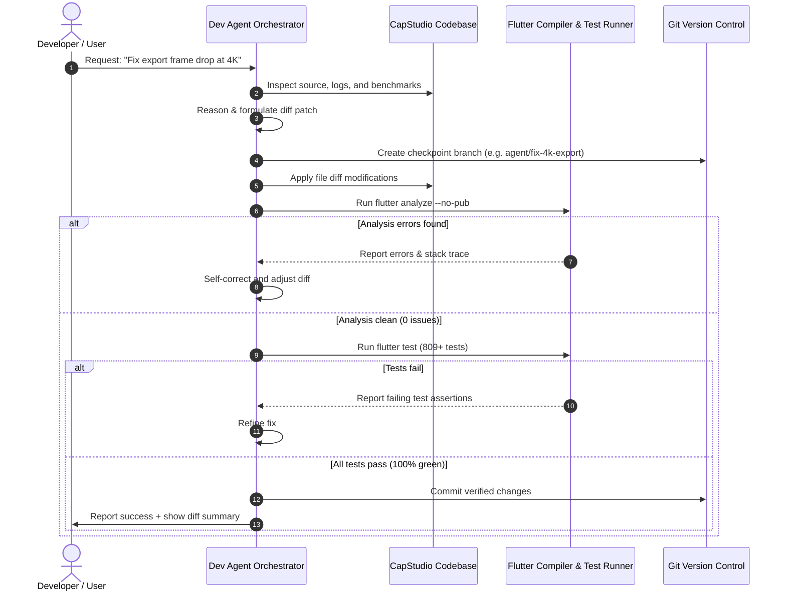

# Self-Improving Autonomous Developer Agent Specification

## 1. Architectural Philosophy

A self-improving AI developer agent is an autonomous software engineering loop capable of introspecting, reviewing, refactoring, and fixing its host codebase. 

In traditional AI coding assistants, code is generated without deterministic feedback, leading to regressions or broken syntax. In CapStudio's **Self-Improving Developer Agent**, the system operates inside a **closed-loop verification environment**:

---

## 2. Agent Execution Tools & Capabilities

The agent operates via a sandboxed set of tools executed via Dart's `dart:io` `Process.run`:

### 1. `searchCodebase`
* **Purpose:** Performs regex searches across `lib/`, `test/`, and `android/`.
* **Signature:** `Future<List<SearchResult>> searchCodebase(String pattern, {String? pathPrefix})`

### 2. `viewFile`
* **Purpose:** Reads bounded line slices of source files to avoid memory pressure and token limits.
* **Signature:** `Future<String> viewFile(String absolutePath, {int? startLine, int? endLine})`

### 3. `applyFilePatch`
* **Purpose:** Applies targeted, contiguous string replacements.
* **Constraints:** Must fail atomically if `targetContent` does not match the exact character sequence.
* **Signature:** `Future<bool> applyFilePatch(String absolutePath, String targetContent, String replacementContent)`

### 4. `runStaticAnalysis`
* **Purpose:** Runs `flutter analyze --no-pub`.
* **Output:** Returns exit code and error list. Zero issues required to proceed.

### 5. `runTestSuite`
* **Purpose:** Runs `flutter test [optional_path]`.
* **Output:** Returns test pass count, failure count, and failure assertions. Must maintain 100% pass rate (809+ tests passing).

### 6. `gitRollback`
* **Purpose:** Resets modified files to the last known good commit (`git checkout .`).

---

## 3. Strict Architectural Guardrails

To prevent the AI from degrading code quality, the agent is constrained by automated hard rules:

| Rule | Constraint | Enforcement Mechanism |
| :--- | :--- | :--- |
| **Max File Length** | All `.dart` files must remain strictly **< 1,000 lines**. | Pre-commit file line scanner rejects any commit where file lines $\ge 1000$. |
| **Design Token Integrity** | **Zero raw `Colors.*`** allowed. Must exclusively use [`AppTheme`](file:///a:/Projects/CapStudio/lib/app/theme.dart) design tokens. | Regex scanner audits all added lines for `Colors.` or hardcoded hex values. |
| **Monetization Ban** | Strictly zero paywalls, subscription models, or premium gates. | Code scanner audits keywords (`subscription`, `paywall`, `in_app_purchase`). |
| **Compile & Test Parity** | `flutter analyze` must report 0 issues; all 809 unit & widget tests must pass. | Automated CI verification pipeline. |
| **Loop Bounding** | Max self-correction attempts: **5 iterations**. | Hard loop breaker; reverts changes and alerts developer if unresolved after 5 tries. |

---

## 4. Live Hot-Reload Integration (In-App Developer Drawer)

When running CapStudio locally in debug mode (`flutter run -d windows`):
1. The developer can open a sliding **AI Developer Drawer** from the top app bar.
2. The developer types an instruction or clicks **"Diagnose Last Crash"**.
3. The embedded agent:
   - Reads runtime stderr logs from [`LoggerService`](file:///a:/Projects/CapStudio/lib/core/logger/logger_service.dart).
   - Edits the source code file.
   - Runs validation.
   - Triggers the Flutter VM Service Hot Reload RPC via `vm_service`.
4. The running desktop app updates **instantly in real time** on the developer's monitor.

---

## 5. Recommended Models for Self-Improving Coding

1. **DeepSeek R1 / V3:** Outstanding mathematical and architectural reasoning; understands complex multi-step state mixins in Flutter.
2. **Qwen 2.5 Coder (32B / 72B):** Highest syntax adherence for Dart code generation and diff replacement.
3. **Claude 3.5 Sonnet:** State-of-the-art multi-file refactoring and constraint compliance.
4. **Gemini 2.0 Flash:** Ultra-fast context window capable of ingesting the entire CapStudio codebase in one pass for global cross-file dependency analysis.
