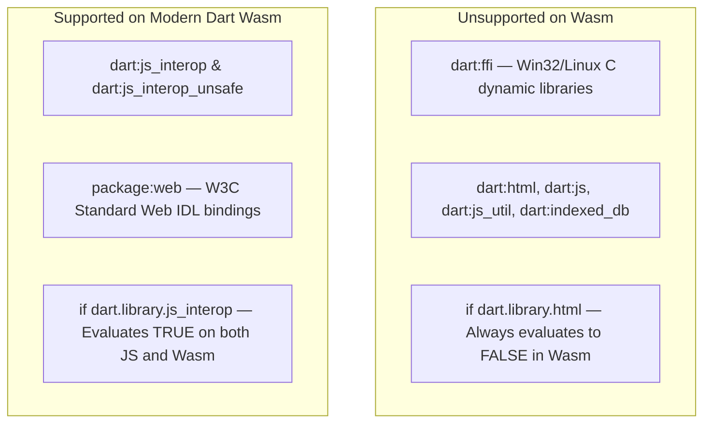

# WebAssembly (Wasm) & Cross-Platform Build Architecture Guide

## 1. WebAssembly (`--wasm`) Architecture in CapStudio

Flutter 3.22+ and Dart 3.4+ introduce support for compiling web targets directly to **WebAssembly (Wasm)** via `dart2wasm`. WebAssembly execution provides near-native performance, eliminates JavaScript JIT overhead, and delivers silky-smooth 60fps/120fps video timeline scrubbing in browsers.

However, Wasm enforces strict runtime boundaries that differ fundamentally from traditional `dart2js` (JavaScript):



---

## 2. Resolving the `isar_community` Wasm Incompatibility

### The Core Problem
1. **Flawed Conditional Import:** Upstream `isar_community` imports `src/native/isar_core.dart` if `dart.library.html` is false. Under `dart2wasm`, `dart.library.html` evaluates to `false`, causing the compiler to erroneously load native C-FFI bindings (`dart:ffi`).
2. **Legacy Web Dependencies:** `isar_community`'s `src/web/` directory imported deprecated libraries (`dart:html`, `dart:js`, `dart:indexed_db`, `package:js`) that fail Wasm compilation.

### The Architectural Solution
1. **Local Override Package:**
   In [`packages/isar_community/`](file:///a:/Projects/CapStudio/packages/isar_community/) (wired via `dependency_overrides` in [`pubspec.yaml`](file:///a:/Projects/CapStudio/pubspec.yaml)):
   - Updated conditional imports to check `dart.library.js_interop`:
     ```dart
     import 'package:isar_community/src/native/isar_core.dart'
         if (dart.library.js_interop) 'package:isar_community/src/web/isar_web.dart'
         if (dart.library.html) 'package:isar_community/src/web/isar_web.dart';
     ```
   - Replaced legacy `dart:html` and `dart:js` in `src/web/` with pure Dart stubs.
2. **Runtime Storage Layer:**
   - On **Native** (Windows, Android, macOS, Linux, iOS), CapStudio uses the full high-performance C-FFI binary Isar engine.
   - On **Web** (both JS and Wasm), CapStudio uses browser **IndexedDB** via [`WebDbHelper`](file:///a:/Projects/CapStudio/lib/core/database/web_db_helper_web.dart), completely bypassing Isar native C binaries.

### Verification Command
```bash
flutter build web --wasm --no-pub
# Output: √ Built build\web (Exit code 0)
```

---

## 3. Web Helper Modernization Reference

All web-specific utilities in CapStudio have been modernized from legacy `dart:html` to modern W3C standards:

| File | Legacy Implementation | Modern Wasm Implementation |
| :--- | :--- | :--- |
| [`web_download_helper_web.dart`](file:///a:/Projects/CapStudio/lib/core/utils/web_download_helper_web.dart) | `dart:html` `Blob`, `AnchorElement` | `package:web` (`web.Blob`, `web.HTMLAnchorElement`, `web.URL.createObjectURL`) |
| [`waveform_web_helper_web.dart`](file:///a:/Projects/CapStudio/lib/core/audio/waveform_web_helper_web.dart) | `dart:html` `HttpRequest`, `dart:web_audio` | `package:web` `OfflineAudioContext` + standard `package:http` |
| [`video_web_helper_web.dart`](file:///a:/Projects/CapStudio/lib/core/video/video_web_helper_web.dart) | `dart:js_util` `getProperty` | `dart:js_interop_unsafe` `JSObject.getProperty` |

---

## 4. Android Build Offline Dependency Architecture

### The Problem Diagnosed
`media_kit_libs_android_video-1.3.8/android/build.gradle` defines a task `downloadDependencies` that attempts to stream 4 large architecture JARs (`default-arm64-v8a.jar`, `default-armeabi-v7a.jar`, `default-x86_64.jar`, `default-x86.jar`) directly from GitHub Releases inside the Gradle JVM using `new URL().openStream()`.
When GitHub connection timeouts or MD5 mismatches occur, Gradle builds fail with:
`A problem occurred evaluating project ':media_kit_libs_android_video'. > Connection timed out: connect`

### The Solution: Offline Cache & Auto-Sync
1. **Permanent Offline Binary Storage:**
   The verified libmpv JAR files are permanently stored in [`android/media_kit_cache/v1.1.7/`](file:///a:/Projects/CapStudio/android/media_kit_cache/v1.1.7/).
2. **Automated Gradle Restore in `build.gradle.kts`:**
   In [`android/build.gradle.kts`](file:///a:/Projects/CapStudio/android/build.gradle.kts), before any subproject evaluates, Gradle automatically synchronizes the offline cache:
   ```kotlin
   val mediaKitCacheDir = file("media_kit_cache/v1.1.7")
   if (mediaKitCacheDir.exists()) {
       val targetDir = file("../../build/media_kit_libs_android_video/v1.1.7")
       targetDir.mkdirs()
       mediaKitCacheDir.listFiles()?.forEach { src ->
           val dst = File(targetDir, src.name)
           if (!dst.exists() || dst.length() == 0L) {
               src.copyTo(dst, overwrite = true)
           }
       }
   }
   ```
3. **Result:** Even after running `flutter clean`, Gradle builds will never stall or attempt to connect to GitHub.

### Verification Command
```bash
flutter build apk --no-pub
# Output: √ Built build\app\outputs\flutter-apk\app-release.apk (Exit code 0)
```
