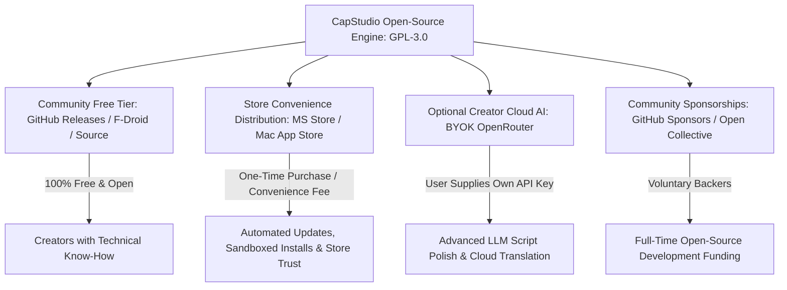

# 💡 CapStudio: Open-Source Sustainability & Distribution Strategy

This blueprint outlines the distribution architecture, legal compliance, and ethical sustainability model for **CapStudio** across all 6 supported platforms (Windows, macOS, Linux, Android, iOS, and Web).

CapStudio is built as a **100% on-device, offline-first, open-source video captioning and editing studio** licensed under the **GNU General Public License v3 (GPL-3.0)**. Core speech-to-text inference (Whisper) and video rendering (FFmpeg) run locally on the creator's machine with zero telemetry, zero mandatory internet access, and zero subscription paywalls.

---

## 🧭 Core Architectural Principles

1. **100% On-Device & Privacy-First:**
   - No user video, audio, transcription, or metadata ever leaves the client machine.
   - No tracking SDKs, analytics beacons, or advertising networks are bundled into production releases.
   - Core features function completely without internet connectivity.

2. **GPL-3.0 Compliance & Transparency:**
   - Source code is freely accessible, auditable, and modifiable under GPL-3.0.
   - Open-source licenses for dependencies (Whisper.cpp under MIT, FFmpeg with libass under GPL-3.0, Flutter under BSD-3, Isar under Apache-2.0) are strictly attributed and preserved side-by-side in `bin/` and `CREDITS.md`.

3. **No Artificial Paywalls or Forced Internet Checks:**
   - The app never displays "Internet Required" lockouts or restricts access to local timeline tools.
   - No user is coerced into watching advertisements or creating cloud accounts.

---

## 🏛️ Sustainable Open-Source Models (The "Krita & Blender" Framework)

Major open-source desktop creative software (such as Krita, Blender, OBS Studio, and ShareX) achieve multi-million dollar sustainability while remaining 100% free software. CapStudio leverages the same proven strategies:

---

### 1. Store Convenience Packaging (App Store / Microsoft Store)
- **Concept:** Provide free standalone builds on GitHub Releases, Flathub, and Android APK downloads, while offering one-click store packages on the Microsoft Store ($4.99–$9.99) and Mac App Store.
- **Value Proposition for Creators:**
  - Automatic silent background updates without manual installer downloads.
  - Microsoft Store and Apple App Store sandboxing and security verification.
  - Enterprise-safe installation on school or corporate computers where external executables are restricted.
  - Seamless re-installation across all devices connected to the user's Microsoft or Apple ID.
- **Legal Legality:** GPL-3.0 explicitly permits distributing compiled software through app stores for a convenience fee, provided the corresponding source code remains publicly accessible.

---

### 2. Optional Creator Cloud AI (Bring-Your-Own-Key / BYOK)
- **Concept:** While local Whisper transcription is always 100% free and offline, advanced generative AI features (e.g. LLM transcript summarization, multi-language translation, viral hook brainstorming) can be enabled by allowing users to enter their own **OpenRouter**, **OpenAI**, or **Anthropic** API keys.
- **Cost to Maintainers:** Zero server infrastructure costs or API billing liability.
- **Creator Freedom:** Creators pay fractions of a cent directly to LLM providers for the exact compute they consume, with zero markup or recurring SaaS overhead.

---

### 3. Creator Asset & Preset Ecosystem
- **Concept:** Community creators and artists can design and publish custom animated caption templates, kinetic typography styles, branded sound effects, and sticker packs (`.cappreset` and `.capplugin`).
- **Distribution:**
  - Standard templates and built-in fonts (52 fonts, 5 emoji packs) are bundled free.
  - Creators can share or sell third-party preset bundles on platforms like Gumroad or Etsy.

---

### 4. Community Backing & Sponsorship
- **Platforms:** GitHub Sponsors, Open Collective, and Patreon.
- **Perks for Backers:**
  - Prioritized feature request voting.
  - Early access to experimental builds (e.g. multi-track timeline beta, GPU fragment shader previews).
  - Listed in the in-app credits screen ([`AboutAppScreen`](file:///a:/Projects/CapStudio/lib/features/settings/presentation/views/about_app_screen.dart)).

---

## 🔒 Security & Code Integrity (Without User-Hostile DRM)

Rather than implementing user-hostile anti-tamper DRM that degrades offline performance, CapStudio focuses on legitimate software supply-chain integrity:

1. **Digital Code Signing:**
   - **Windows:** Microsoft Authenticode signing (`signtool`) to eliminate Windows SmartScreen warnings.
   - **macOS:** Apple Developer ID signing and `notarytool` notarization to eliminate Gatekeeper warnings.
   - **Android:** Google Play App Signing with upload keystores.

2. **Supply-Chain Verification:**
   - Automated SHA-256 integrity verification for all downloaded model weights and tool bundles.
   - Fail-closed verification preventing malicious man-in-the-middle binary tampering.

3. **Reproducible Builds:**
   - Clean GitHub Actions CI/CD pipeline producing verifiable hashes matching release artifacts.
